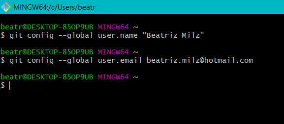

```{r setup, include=FALSE}
options(htmltools.dir.version = FALSE)

knitr::opts_chunk$set(echo = FALSE, fig.align = "center")
```

layout: false
class: split-33 with-border

.column.bg-main3[.content.vmiddle[
.center[
# Beatriz Milz
]
<br><br>
```{r, out.width="90%"}
knitr::include_graphics("img/bea.jpg")
```

]]
.column[.content[

- Doutoranda no Programa de Pós-Graduação em Ciência Ambiental (PROCAM) - Instituto de Energia e Ambiente - Universidade de São Paulo

  - Bolsita FAPESP - Processo nº 2018/23771-6 
  
  - Projeto Temático FAPESP Macroamb - Processo nº 2015/03804-9 
  
```{r, out.width="50%"}
knitr::include_graphics("img/logos_bia.png")
```

- Equipe da Secretaria Executiva  Editorial - [Revista Ambiente & Sociedade](http://scielo.br/asoc)

- Co-organizadora - [R-Ladies São Paulo](https://www.meetup.com/pt-BR/R-Ladies-Sao-Paulo) `r emo::ji("purple_heart")`

- [Currículo disponível neste link](https://beatrizmilz.github.io/resume/index.pdf)

- Anteriormente:
  - Mestre em Ciências - UNIFESP
  - Bacharel em Gestão Ambiental - EACH/USP


]]
---
class: middle

```{r out.width="30%"}
knitr::include_graphics("https://media3.giphy.com/media/VMmRM3EjhjBII/giphy-downsized.gif")
```

---
class: middle

```{r out.width="100%"}
knitr::include_graphics("https://media1.giphy.com/media/qvWavuCEwjEPu/giphy.gif")
```

---
layout: false
class: split-33 with-border

.column.bg-main3[.content.vmiddle[
.center[
# Sobre essa palestra]
<br><br>


- **Objetivo**: Auxiliar nos primeiros passos a utilizar o `Git` e `GitHub` diretamente do `RStudio`.

]]

.column.bg-main1[
  .split-five[
  .row.bg-main1[.content[
  ## Pré-requisitos
  ]]
  .row.bg-main2[.content[
  ##  Configurando o Git
  ]]
  .row.bg-main3[.content[
  ##  Configurando o GitHub
  ]]
  .row.bg-main4[.content[
  ##  Trabalhando com projetos no `RStudio` + `GitHub`
  ]]
  .row.bg-main5[.content[
  ##  Interface gráfica do RStudio - aba `Git`
  ]]
]]


---
layout: false
class: bg-main3 split-30 hide-slide-number

.column[

]
.column.slide-in-right[.content.vmiddle[
.sliderbox.shade_main.pad1[
.font5[Pré-requisitos]
]
]]

---
class: middle
# Pré-requisitos

.pull-left[
## R 
  - [Download neste link](https://cran.r-project.org/)
  - Use a versão mais recente `r emo::ji("wink")`


  
]

.pull-right[
```{r, out.width="100%"}
knitr::include_graphics("img/R_logo.svg.png")
```
]


---
class:middle

```{r, out.width="100%"}
knitr::include_graphics("img/prints/install_R.png")
```

---
class: middle
# Pré-requisitos

.pull-left[
## RStudio
  - [Download neste link](https://www.rstudio.com/products/rstudio/download/)
  - Use a versão mais recente `r emo::ji("wink")`
  

  
]

.pull-right[
```{r out.width="100%"}
knitr::include_graphics("img/rstudio.png")
```
]

---
class:middle

```{r, out.width="100%"}
knitr::include_graphics("img/prints/install_RStudio.png")
```

---
class: middle
# Pré-requisitos


.pull-left[
## Criar um conta gratuita no GitHub
  - [Neste link](https://github.com/)
  - Caso já tenha, não é preciso criar uma nova conta.
  
  
  - Se for estudante: 
    - [GitHub Student Developer Pack](https://education.github.com/pack) - utiliza email institucional da universidade.
  
]

.pull-right[
```{r out.width="100%"}
knitr::include_graphics("img/github-logo.png")
```
]


---
class: middle

# Pré-requisitos


.pull-left[

## Git 
  - [Download neste link](https://git-scm.com/downloads)

  

]


.pull-right[
```{r out.width="80%"}
knitr::include_graphics("https://git-scm.com/images/logo@2x.png")
```

]
---
class:middle

```{r, out.width="70%"}
knitr::include_graphics("img/prints/install-git.png")
```


---
class: middle
# Pré-requisitos

.pull-left[
## Pacote [`usethis`](https://usethis.r-lib.org/)

```{r echo=TRUE, eval=FALSE}
install.packages("usethis")
library(usethis)
```
]

.pull-right[
```{r}
knitr::include_graphics("https://usethis.r-lib.org/reference/figures/logo.png")
```
]

---
layout: false
class: bg-main3 split-30 hide-slide-number

.column[

]
.column.slide-in-right[.content.vmiddle[
.sliderbox.shade_main.pad1[
.font5[.center[Configurando o Git]]
]
]]


---
class: middle
# Configurando o Git

- É necessário fazer apenas uma vez (por computador)!

- Duas possibilidades: no Git, ou no RStudio.

- Informar para o Git seu nome, e email.

- Utilize o mesmo email associado à sua conta do GitHub.

  - No RStudio:

```{r echo=TRUE, eval=FALSE}
usethis::use_git_config(user.name = "Beatriz Milz", # Seu nome
                        user.email = "beatriz.milz@hotmail.com") # Seu email
```

---
class: middle
# Configurando o Git

  - No Git:

`$ git config --global user.name "Beatriz Milz"`


`$ git config --global user.email beatriz.milz@hotmail.com`


```{r out.width="80%"}

```

---
layout: false
class: bg-main3 split-30 hide-slide-number

.column[

]
.column.slide-in-right[.content.vmiddle[
.sliderbox.shade_main.pad1[
.font5[.center[Configurando o GitHub + RStudio]]
]
]]
---
class: middle
# Configurando o GitHub + RStudio

- Criar um novo token no GitHub:

```{r echo=TRUE, eval=FALSE}
usethis::browse_github_token()
# ✔ Opening URL 'https://github.com/settings/tokens/new?scopes=repo,gist&description=R:GITHUB_PAT'
# ● Call `usethis::edit_r_environ()` to open '.Renviron'.
# ● Store your PAT with a line like:
{{#   GITHUB_PAT=xxxyyyzzz}}
#   [Copied to clipboard]
# ● Make sure '.Renviron' ends with a newline!
```

- Uma página do GitHub irá abrir, com as configurações necessárias. Você pode alterar o nome do token, para saber em qual computador está vinculando. Crie o novo token.

---
class: middle  bg-main4

### Exemplo:

```{r out.width="100%"}
knitr::include_graphics("img/gifs/browse-github-token2.gif")
```

---
- Copie o token gerado:

```{r out.width="100%"}
knitr::include_graphics("img/prints/copy-token.png")
```
---
- Abra o arquivo `.Renviron`:
```{r echo=TRUE, eval=FALSE}
usethis::edit_r_environ()
# ● Modify 'C:/Users/beatr/Documents/.Renviron'
# ● Restart R for changes to take effect
```

- Crie uma nova linha na forma `GITHUB_PAT=SEU_TOKEN`, adicione o token, pule uma linha e salve o arquivo.
```{r out.width="60%"}
knitr::include_graphics("img/prints/githubpath.png")
```
- **Reinicie o RStudio**:  CTRL + SHIFT + F10

---
layout: false
class: bg-main3 split-30 hide-slide-number

.column[

]
.column.slide-in-right[.content.vmiddle[
.sliderbox.shade_main.pad1[
.font5[.center[Trabalhando com projetos no RStudio + GitHub]]
]
]]

---

# Prática 1 - Criando um repositório novo, diretamente do R

- Vamos usar a função `create_project()` 
  - Cria um projeto `.Rproj`
  - Argumento importante: `path` - 	É o "caminho" para o diretório (pasta). Se o diretório já existe, é utilizado. Se não existe, é criado. 
  - Cuidado com o nome do projeto, pois será o mesmo nome que será utilizado no repositório. Você não deve usar o nome de algum repositório já existente no seu GitHub.


- No meu caso, tenho o hábito de deixar todos os repositórios do GitHub, na pasta `GitHub/`. No exemplo abaixo, dentro da pasta GitHub, criei o projeto chamado Teste-MeetupR. Esse será o nome da pasta criada e posteriormente do repositório no GitHub.

```{r echo=TRUE, eval=FALSE}
usethis::create_project("GitHub/Teste-MeetupR") 
# ✔ Creating 'GitHub/Teste-MeetupR/'
# ✔ Setting active project to 'C:/Users/beatr/Documents/GitHub/Teste-MeetupR'
# ✔ Creating 'R/'
# ✔ Writing 'Teste-MeetupR.Rproj'
# ✔ Adding '.Rproj.user' to '.gitignore'
# ✔ Opening 'GitHub/Teste-MeetupR/' in new RStudio session
# ✔ Setting active project to '<no active project>'
```
- O RStudio abrirá outra janela, com o novo projeto criado.
---
## Novo projeto criado! 

- Projeto `r emo::ji("heavy_check_mark")`

- Git `r emo::ji("x")`

- GitHub `r emo::ji("x")`

```{r out.width="70%"}
knitr::include_graphics("img/prints/novo_projeto.png")
```

---

```{r echo=TRUE, eval=FALSE}
usethis::use_git()
# ✔ Setting active project to 'C:/Users/beatr/Documents/GitHub/Teste-MeetupR'
# ✔ Initialising Git repo
# ✔ Adding '.Rhistory', '.RData' to '.gitignore'
# There are 2 uncommitted files:
# * '.gitignore'
# * 'Teste-MeetupR.Rproj'
# Is it ok to commit them?
# 
{{# 1: Absolutely  }}
# 2: Negative
# 3: No
# 
# Selection: 1
# ✔ Adding files
# ✔ Commit with message 'Initial commit'
# ● A restart of RStudio is required to activate the Git pane
# Restart now?
# 
# 1: No way
{{# 2: For sure}}
# 3: Negative
# 
# Selection: 2
```

- O RStudio irá reiniciar para que apareça o painel do Git
---
## Usando Git

- Projeto `r emo::ji("heavy_check_mark")`

- Git `r emo::ji("heavy_check_mark")`

- GitHub `r emo::ji("x")`

```{r out.width="70%"}
knitr::include_graphics("img/prints/novo_projeto_com_git.png")
```


---
```{r echo=TRUE, eval=FALSE}
usethis::use_github()
# ✔ Setting active project to 'C:/Users/beatr/Documents/GitHub/Teste-MeetupR'
# ✔ Checking that current branch is 'master'
# Which git protocol to use? (enter 0 to exit) 
# 
# 1: ssh   <-- presumes that you have set up ssh keys
{{# 2: https <-- choose this if you don't have ssh keys (or don't know if you do)}}
# 
# Selection: 2
# ● Tip: To suppress this menu in future, put
#   `options(usethis.protocol = "https")`
#   in your script or in a user- or project-level startup file, '.Rprofile'.
#   Call `usethis::edit_r_profile()` to open it for editing.
# ● Check title and description
#   Name:        Teste-MeetupR
#   Description: 
# Are title and description ok?
# 
# 1: No way
{{# 2: Definitely}}
# 3: Nope
# 
# Selection: 2
# ✔ Creating GitHub repository
# ✔ Setting remote 'origin' to 'https://github.com/beatrizmilz/Teste-MeetupR.git'
# ✔ Pushing 'master' branch to GitHub and setting remote tracking branch
# ✔ Opening URL 'https://github.com/beatrizmilz/Teste-MeetupR'
```

---
## Repositório criado!

- Projeto `r emo::ji("heavy_check_mark")`

- Git `r emo::ji("heavy_check_mark")`

- GitHub `r emo::ji("heavy_check_mark")`

```{r out.width="70%"}
knitr::include_graphics("img/prints/criou-repositorio-github.PNG")
```

---

## Função para criar um arquivo `README.md`
```{r, echo=TRUE, eval=FALSE}
usethis::use_readme_md()

```
- O arquivo será criado e aberto, para ser editado e salvo.

```{r, out.width="30%"}
knitr::include_graphics("https://media2.giphy.com/media/1iu8uG2cjYFZS6wTxv/giphy-downsized.gif")
```


---
class: middle  bg-main4

### Exemplo:

```{r out.width="100%"}
knitr::include_graphics("img/gifs/create-proj2.gif")
```

---
# Prática 2 - Clonando um repositório do GitHub

- Crie um repositório no GitHub, ou abra a página de um repositório já existente


- No RStudio, crie um novo projeto: File > New Project > Version Control > Git.

---

# Prática 3 - Fork + Clone

```{r echo=TRUE, eval=FALSE}
usethis::create_from_github("rstudio-education/datascience-box", #usuário/repositório
                   destdir = "C:/Users/beatr/Documents/GitHub", #diretório onde quer que os arquivos sejam salvos
                   fork = TRUE)
# ✔ Creating 'C:/Users/beatr/Documents/GitHub/datascience-box/'
# ✔ Forking 'rstudio-education/datascience-box'
# ✔ Cloning repo from 'https://github.com/beatrizmilz/datascience-box.git' into 'C:/Users/beatr/Documents/GitHub/datascience-box'
# ✔ Setting active project to 'C:/Users/beatr/Documents/GitHub/datascience-box'
# ✔ Adding 'upstream' remote: 'https://github.com/rstudio-education/datascience-box.git'
# ✔ Pulling changes from GitHub source repo 'upstream/master'
# ✔ Setting remote tracking branch for local 'master' branch to 'upstream/master'
# ✔ Opening 'C:/Users/beatr/Documents/GitHub/datascience-box/' in new RStudio session
# ✔ Setting active project to 'C:/Users/beatr/Documents/GitHub/RLadies-Git-RStudio-2019'
```

Projeto [Data Science in a Box](https://github.com/rstudio-education/datascience-box/)
---
## Crie um branch

```{r echo=TRUE, eval=FALSE}
usethis::pr_init("nome_da_branch")

# ✔ Checking that local branch 'master' has the changes in 'origin/master'
# ✔ Creating local PR branch 'nome_da_branch'
# ✔ Switching to branch 'nome_da_branch'
# ● Use `pr_push()` to create PR
```


---
layout: false
class: bg-main3 split-30 hide-slide-number

.column[

]
.column.slide-in-right[.content.vmiddle[
.sliderbox.shade_main.pad1[
.font5[.center[Interface gráfica do RStudio]]
]
]]
---
class: middle

## Interface Gráfica RStudio

- O RStudio oferece um cliente Git **simples**, na aba "Git" (em inglês, é chamado de Git Pane).

```{r}
knitr::include_graphics("img/prints/git-pane.PNG")
```

---
class: middle

## Branch

```{r}
knitr::include_graphics("img/prints/git-pane-branch.png")
```
---
class: middle

# Botão Diff -> Review changes

```{r, out.width="90%"}
knitr::include_graphics("img/prints/git-pane-diff.PNG")
```

---
class: middle

# Botão `r emo::ji("clock3")` (history) -> Review changes

```{r, out.width="90%"}
knitr::include_graphics("img/prints/git-pane-history.PNG")
```
---
class: center, middle 

## Linha de comando ou interface gráfica?
## Use o que for melhor para **você**!

```{r out.width="50%"}
knitr::include_graphics("https://media0.giphy.com/media/dNgK7Ws7y176U/giphy.gif")
```

---
class: middle  bg-main4

# Referências

- Parte deste material foi baseado/inspirado neste post do blog da [Curso-R](https://www.curso-r.com/), escrito por [Caio Lente](https://lente.dev/):
  - [Git e GitHub (Zen do R - Parte 4)](https://www.curso-r.com/blog/2019-07-23-zen-do-r-4/)
  
- Outra referência importante: [Happy Git and GitHub for the useR - 
Jenny Bryan](https://happygitwithr.com/)

- Documentação do pacote [usethis](https://usethis.r-lib.org/reference/create_package.html)
